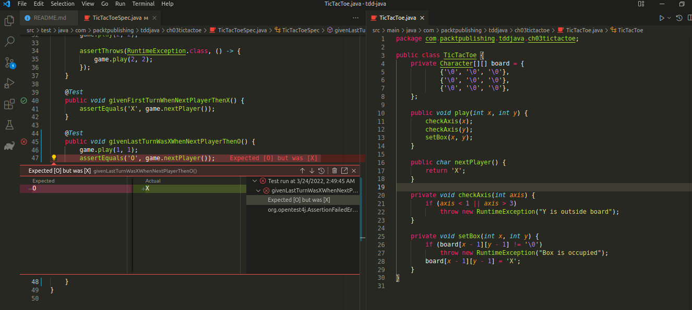

# TDD em Java

Baseado no livro Test-Driven Java Development Invoke TDD principles for 
end-to-end application development with Java Viktor Farcic, Alex Garcia.

## Visual Studio Code

Extensões úteis:

- As extensões do [Extension Pack for Java](https://marketplace.visualstudio.com/items?itemName=vscjava.vscode-java-pack).
Você pode instalá-las individualmente com exceção do Maven for Java. Esse 
projeto usa Gradle
- [Gradle Extension Pack](https://marketplace.visualstudio.com/items?itemName=richardwillis.vscode-gradle-extension-pack)

Com essas extensões ativadas você pode executar os testes com
<kbd>Ctrl</kbd> + <kbd>;</kbd> <kbd>A</kbd>.

Para mais informações, consulte a [documentação de testes com Java no VSCode](https://code.visualstudio.com/docs/java/java-testing#_vs-code-testing-commands).